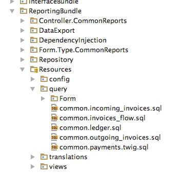

# Proposed solution

Solution is inspired by Symfony's way of loading templates into a controller and rendering response.

Symfony proposes convention where template code is separated (as per MVC) from application logic and held in
`templates` (or `Resources/views`) directory. Required rendering logic can be coded in templates by using very powerful
templating language Twig. Rendering of templates is executed via dedicated service, while templates are identified via
path or bundle resource locator syntax(e.g. `@BundleName::template.html.twig`).

Inspired with that convention, this bundle proposes similar approach:

- Your queries are held in separate files in `query` directory of your application (or `Resources/query` directories for
  bundles, or any other per your desire).
- Queries are files where only query code should exist.
- Complex queries with some kind of query building logic can use Twig as pre-processing script language.
- You can use a dedicated service `RunOpenCode\Bundle\QueryResourcesLoader\Contract\QueryResourcesLoaderInterface` to
  load query from its location and execute it.

## Example

In image below, a real-world example of directory structure of project reporting bundle which uses this bundle is
presented:



**NOTE**: _This image is from project using Symfony 3, that is how old this bundle is, but it is still actively
maintained, battle tested and used in production for latest Symfony version._

In that matter, in order to execute the query stored within one of those files, following code can be used for data
source/repository class:

```php
declare(strict_types=1);

namespace App\Reporting\Repository;

use RunOpenCode\Bundle\QueryResourcesLoader\Contract\QueryResourcesLoaderInterface;
use RunOpenCode\Bundle\QueryResourcesLoader\Executor\Dbal\DbalParameters;

final readonly class ReportingDataSource
{
    public function __construct(private QueryResourcesLoaderInterface $loader) { }     

    public function getLedgerData(Filters $filters): iterable
    {
        return $this->loader->execute('common.ledger.sql', DbalParameters::create()
            ->dateTimeImmutable('from', $filters->getFrom())
            ->dateTimeImmutable('to', $filters->getTo())
            ->integer('account', $filters->getAccount())
        );
    }
}
```

Note how your code gets cleaner by just omitting query statements from your PHP code.

Do note that Doctrine query language for fetching entities is not powerful as raw SQL. However, with this bundle, you
can easily leverage raw SQL queries to fetch identifiers of entities and then fetch entities with Doctrine.

[<< Introduction](introduction.md) | [Table of contents](index.md) | [Twig support >>](twig-support.md)
